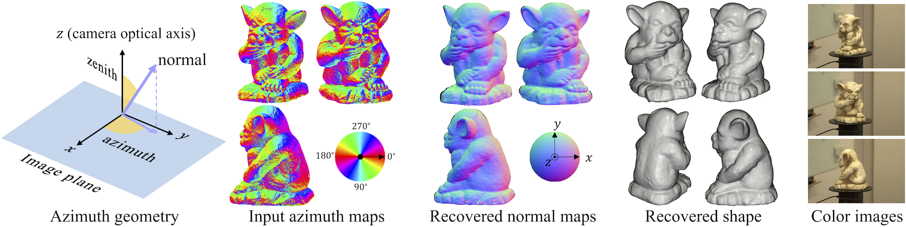

<h1 align="center">Multi-View Azimuth Stereo via Tangent Space Consistency</h1>
<h3 align="center">
    <a href="https://xucao-42.github.io/homepage/"><strong>Xu Cao</strong></a>
    ·
    <a href="https://sites.google.com/view/hiroaki-santo/"><strong>Hiroaki Santo</strong></a>
    ·
    <a href="http://cvl.ist.osaka-u.ac.jp/user/okura/"><strong>Fumio Okura</strong></a>
    ·
    <a href="http://www-infobiz.ist.osaka-u.ac.jp/en/member/matsushita/"><strong>Yasuyuki Matsushita</strong></a>
</h3>
<h3 align="center"><a href="https://cvpr2023.thecvf.com">CVPR 2023 </a></h3>
<p align="center">
  <br>
    <a href="">
      
    </a>
    <a href='https://xucao-42.github.io/mvas_homepage/'>
      </a>
</p>
<div align="center">

3D reconstruction only using surface azimuth maps. 
</div>

# Dependencies
Our code was tested on Ubuntu18.04 with Python 3.9, PyTorch 1.12, and Cuda 11.3 using one RTX 2080 Ti.
Reproduce our environment by
```
conda env create -f environment.yml 
conda activate mvas
```

# Quick Start

```
git clone https://github.com/xucao-42/mvas.git
mkdir mvas/data
cd mvas/code
```

<details><summary>Train on DiLiGenT-MV data (280 MB)</summary>

Download data from [Google Drive](https://drive.google.com/file/d/1C4Uf00nW-quKf_3YGD1M86AIsDMQ8Cj6/view?usp=sharing) and extract it under `data` folder.
Run
```
python exp_runner.py --config configs/diligent_mv.conf
```
</details>

[//]: # (<details><summary>Train on SymPS data &#40;&#41;</summary>)

[//]: # ()
[//]: # (Download data from [Google Drive]&#40;&#41; and extract it under `data` folder.)

[//]: # (Run)

[//]: # (```)

[//]: # (python exp_runner.py --config configs/symps.conf)

[//]: # (```)

[//]: # (</details>)

<details><summary>Train on PANDORA data (2.7 GB)</summary>

Download data from [Google Drive](https://drive.google.com/file/d/1ifbCjTTP7IwxLZXjUux0__acdbZMcY_U/view?usp=sharing) and extract it under `data` folder.
Run
```
python exp_runner.py --config configs/pandora.conf
```
</details>

Results will be saved in `results/$obj_name/$exp_time`.


# Data structure

<details><summary> DiLiGenT-MV </summary>

- `input_azimuth_maps`: These are 16-bit RGBA images where the alpha channel represents the object mask and the RGB channels are identical. 
Each RGB channel can be converted to azimuth angles within [0, pi] by multiplying it by pi/65535. The azimuth angle is measured clockwise from the x-axis, which points to the right, and is consistent with OpenCV conversion (x-axis to the right, y-axis downward). 
The azimuth maps do not need to be stored in the range [0, 2π], as our method is π-invariant.
- `vis_azimuth_maps`: These are for visualization purposes only and are not used during training.
- `normal_maps`: These are the normal maps used to create the input azimuth maps.
- `params.json`: This file is from PS-NeRF and contains the camera intrinsic parameters, as the normal and azimuth maps are cropped to 400 x 400.
- `Calib_Results.mat`: This file is from the original DiLiGenT-MV dataset and provides the camera extrinsic information.
</details>

<details><summary> PANDORA </summary>

- `input_azimuth_maps`:  These are 16-bit RGBA images where the alpha channel represents the object mask and the RGB channels are identical.
  Each RGB channel can be converted to azimuth angles within [0, pi] by multiplying it by pi/65535. The azimuth angle is measured clockwise from the x-axis, which points to the right, and is consistent with OpenCV conversion (x-axis to the right, y-axis downward).
  The azimuth maps do not need to be stored in the range [0, 2π], as our method is π-invariant. Note that PANDORA is a polarization image dataset and the azimuth maps have half-pi ambiguity.
- `vis_azimuth_maps`: These are for visualization purposes only and are not used during training.
- `sparse`: This folder is from PANDORA and contains Colmap-calibrated camera intrinsic and extrinsic information.
- `images`: These are for reference purpose and not used in training.

</details>


# Acknowledgement
Our implementation is built upon [IDR](https://github.com/lioryariv/idr) , and benefits from [PS-NeRF](https://github.com/ywq/psnerf) and [PANDORA](https://github.com/akshatdave/pandora).

# Bibtex
```
@inproceedings{mvas2023cao,
title = {Multi-View Azimuth Stereo via Tangent Space Consistency},
author = {Cao, Xu and Santo, Hiroaki and Okura, Fumio and Matsushita, Yasuyuki},
year = {2023},
booktitle = CVPR,
}
```